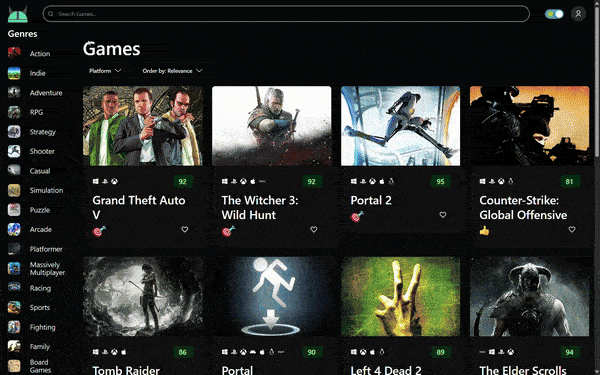

# 🎮 Game Hub

[](https://www.djangoproject.com/)
[](https://reactjs.org/)
[](https://www.postgresql.org/)
[](https://redis.io/)
[](https://www.docker.com/)
[](https://www.gitlab.com/)

A full-stack web application for discovering video games, built with a modern, containerized architecture. This platform allows users to browse a vast library of games, view detailed information, and manage their personal favorites.



---

## ✨ Features

- **Extensive Game Library:** Browse thousands of games with detailed information powered by the RAWG API.
- **Advanced Search & Filtering:** Easily find games by searching, or filter by genre and platform.
- **User Authentication:** Secure user registration and login system using JWT.

  

- **Personalized Profiles:** Users can update their personal information and view their collection of favorite games.
- **Favoriting System:** Logged-in users can add or remove any game from their personal favorites list.
- **Fully Containerized:** The entire application stack (Frontend, Backend, Database, Cache) is containerized with Docker for a seamless and consistent development and production environment.
- **Optimized for Production:** Includes a production-ready setup with Gunicorn, Nginx, and Redis caching.

## 🛠️ Tech Stack

The project is built with a modern, decoupled architecture using the following technologies:

### Backend

| Category           | Technology                                                                                                      |
| :----------------- | :-------------------------------------------------------------------------------------------------------------- |
| **Framework**      | [Django](https://www.djangoproject.com/), [Django Rest Framework](https://www.django-rest-framework.org/)       |
| **Authentication** | [Djoser](https://djoser.readthedocs.io/), [Simple JWT](https://django-rest-framework-simplejwt.readthedocs.io/) |
| **Database**       | [PostgreSQL](https://www.postgresql.org/) with [Psycopg2](https://www.psycopg.org/)                             |
| **Caching**        | [Redis](https://redis.io/) with [django-redis](https://github.com/jazzband/django-redis)                        |
| **Web Server**     | [Gunicorn](https://gunicorn.org/) with [Gevent](http://www.gevent.org/) workers                                 |

### Frontend

| Category             | Technology                                                                                                  |
| :------------------- | :---------------------------------------------------------------------------------------------------------- |
| **Framework**        | [React](https://reactjs.org/)                                                                               |
| **Language & Build** | [TypeScript](https://www.typescriptlang.org/), [Vite](https://vitejs.dev/)                                  |
| **UI Library**       | [Chakra UI](https://chakra-ui.com/), [React Icons](https://react-icons.github.io/react-icons/)              |
| **State Management** | [Zustand](https://zustand-demo.pmnd.rs/), [TanStack Query (React Query)](https://tanstack.com/query/latest) |
| **API Client**       | [Axios](https://axios-http.com/)                                                                            |
| **Routing**          | [React Router](https://reactrouter.com/)                                                                    |
| **Form Handling**    | [React Hook Form](https://react-hook-form.com/) with [Zod](https://zod.dev/) for validation                 |

### Infrastructure

| Category             | Technology                                                                            |
| :------------------- | :------------------------------------------------------------------------------------ |
| **Containerization** | [Docker](https://docker.com/), [Docker Compose](https://docs.docker.com/compose/)     |
| **CI/CD Automation** | [GitLab(CI/CD)](https://www.gitlab.com/)                                              |
| **Web Server/Proxy** | [Nginx](https://www.nginx.com/)                                                       |

## 🚀 Getting Started

These instructions will get you a copy of the project up and running on your local machine for development and testing purposes.

### Prerequisites

You must have the following software installed on your machine:

- [Git](https://git-scm.com/)
- [Docker](https://www.docker.com/products/docker-desktop/)
- [Docker Compose](https://docs.docker.com/compose/install/) (usually included with Docker Desktop)

### Installation & Setup

1.  **Clone the Repository**

    ```bash
    git clone [https://github.com/megqd/game-hub-fullstack.git](https://github.com/megqd/game-hub-fullstack.git)
    cd game-hub-fullstack
    ```

2.  **Create the Environment File**
    Create a `.env` file in the root of the project. You can copy the example file:

    ```bash
    cp .env.example .env
    ```

    Update the `.env` file with your database credentials, a Django SECRET_KEY, and your RAWG_API_key.

3.  **Build and Run with Docker Compose**
    This command will build the Docker images for the frontend and backend and start all the necessary services.

    ```bash
    docker-compose up --build -d
    ```

    The application should now be running.

    - **Frontend:** [http://localhost:3001](http://localhost:3000)
    - **Backend API:** [http://localhost:8001/api/](http://localhost:8000/api/)

4.  **One-Time Database Setup (Important)**
    After the containers are running for the first time, you need to set up the database. Open a **new terminal window** and run the following commands:

    - **Seed the Database with Games:** This command will populate the database with games from the RAWG API. This is a long-running process.
      ```bash
      docker compose exec backend python manage.py seed_db
      ```

Your application is now fully set up and ready to use!

---

## 🎈 Usage

- Open your browser and go to `http://localhost:3001`.
- Filter games by Genres and Platforms from the sidebars.
- Use the search bar to find specific games by name.
- Click on a game card to navigate to its detailed view.
- Click on the user icon in the top-right to register a new account or sign in.

**Once signed-in, you can:**

- Click the heart icon on any game to add it to your favorites.
- Access your profile page to change your information or view your list of favorite games.

## 🤝 Contributing

Contributions, issues, and feature requests are welcome! Feel free to check the [issues page](https://github.com/megqd/game-hub-fullstack/issues) if you'd like to contribute.

## 📬 Contact

[MohammadReza Karimi] - [mrk272727mrk@gmail.com]

Project Link: [https://github.com/megqd/game-hub-fullstack](https://github.com/megqd/game-hub-fullstack)
