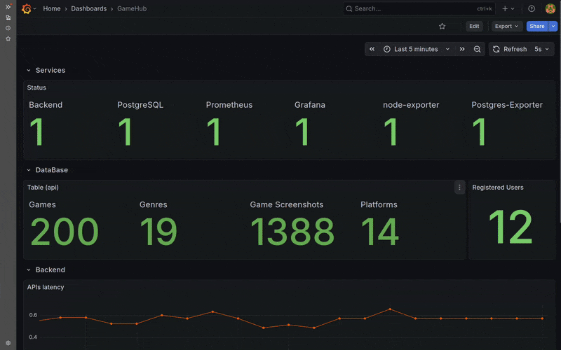

# 🎮 Game Hub

[](https://img.shields.io/badge/Django-092E20?style=for-the-badge&logo=django&logoColor=white)
[](https://img.shields.io/badge/React-61DAFB?style=for-the-badge&logo=react&logoColor=black)
[](https://img.shields.io/badge/PostgreSQL-4169E1?style=for-the-badge&logo=postgresql&logoColor=white)
[](https://img.shields.io/badge/Redis-DC382D?style=for-the-badge&logo=redis&logoColor=white)
[](https://img.shields.io/badge/Docker-2496ED?style=for-the-badge&logo=docker&logoColor=white)
[](https://img.shields.io/badge/GitLab-ffffff?style=for-the-badge&logo=gitlab&logoColor=orange)
[](https://img.shields.io/badge/Prometheus-E6522C?style=for-the-badge&logo=prometheus&logoColor=white)
[](https://img.shields.io/badge/Grafana-F2F4F9?style=for-the-badge&logo=grafana&logoColor=orange)
[](https://img.shields.io/badge/Nginx-009639?logo=nginx&logoColor=white&style=for-the-badge)

A full-stack web application for discovering video games, built with a modern, containerized architecture. This platform allows users to browse a vast library of games, view detailed information, and manage their personal favorites.


## 📋 Table of Contents
- [Features](#features)
- [Tech Stack](#tech-stack)
- [Getting Started](#getting-started)
- [Usage](#usage)
- [CI/CD Pipeline](#cicd-pipeline)
- [Monitoring & Observability](#monitoring-observability)
- [Load Balancing](#load-balancing)
- [Contributing](#contributing)
- [Contact](#contact)

---

## <a id="features"></a>✨ Features

- **Extensive Game Library:** Browse thousands of games with detailed information powered by the RAWG API.
- **Advanced Search & Filtering:** Easily find games by searching, or filter by genre and platform.
- **User Authentication:** Secure user registration and login system using JWT.

  

- **Personalized Profiles:** Users can update their personal information and view their collection of favorite games.
- **Favoriting System:** Logged-in users can add or remove any game from their personal favorites list.
- **Fully Containerized:** The entire application stack is containerized with Docker for a seamless and consistent development and production environment.
- **Monitoring & Observability:** Integrated Prometheus for metrics collection and Grafana for visualization, providing real-time insights into database statistics, backend latency, CPU usage, and system resources.

  

## <a id="tech-stack"></a>🛠️ Tech Stack

The project is built with a modern, decoupled architecture using the following technologies:

### Infrastructure

| Category             | Technology                                                                            |
| :------------------- | :------------------------------------------------------------------------------------ |
| **Containerization** | [Docker](https://docker.com/), [Docker Compose](https://docs.docker.com/compose/)     |
| **CI/CD Automation** | [GitLab(CI/CD)](https://www.gitlab.com/)                                              |
| **Monitoring**       | [Prometheus](https://prometheus.io/), [Grafana](https://grafana.com/)                 |
| **Load Balancing**   | [Nginx](https://www.nginx.com/)                                                       |

### Backend

| Category           | Technology                                                                                                      |
| :----------------- | :-------------------------------------------------------------------------------------------------------------- |
| **Framework**      | [Django](https://www.djangoproject.com/), [Django Rest Framework](https://www.django-rest-framework.org/)       |
| **Authentication** | [Djoser](https://djoser.readthedocs.io/), [Simple JWT](https://django-rest-framework-simplejwt.readthedocs.io/) |
| **Database**       | [PostgreSQL](https://www.postgresql.org/) with [Psycopg2](https://www.psycopg.org/)                             |
| **Caching**        | [Redis](https://redis.io/) with [django-redis](https://github.com/jazzband/django-redis)                        |
| **Web Server**     | [Gunicorn](https://gunicorn.org/)                                                                               |

### Frontend

| Category             | Technology                                                                                                  |
| :------------------- | :---------------------------------------------------------------------------------------------------------- |
| **Framework**        | [React](https://reactjs.org/)                                                                               |
| **Language & Build** | [TypeScript](https://www.typescriptlang.org/), [Vite](https://vitejs.dev/)                                  |
| **UI Library**       | [Chakra UI](https://chakra-ui.com/), [React Icons](https://react-icons.github.io/react-icons/)              |
| **State Management** | [Zustand](https://zustand-demo.pmnd.rs/), [TanStack Query (React Query)](https://tanstack.com/query/latest) |
| **API Client**       | [Axios](https://axios-http.com/)                                                                            |
| **Routing**          | [React Router](https://reactrouter.com/)                                                                    |
| **Form Handling**    | [React Hook Form](https://react-hook-form.com/) with [Zod](https://zod.dev/) for validation                 |

## <a id="getting-started"></a>🚀 Getting Started

These instructions will get you a copy of the project up and running on your local machine for development and testing purposes.

### Prerequisites

You must have the following software installed on your machine:

- [Git](https://git-scm.com/)
- [Docker](https://www.docker.com/products/docker-desktop/)
- [Docker Compose](https://docs.docker.com/compose/install/) (usually included with Docker Desktop)

### Installation & Setup

1.  **Clone the Repository**

    ```bash
    git clone [https://github.com/megqd/game-hub-fullstack.git](https://github.com/megqd/game-hub-fullstack.git)
    cd game-hub-fullstack
    ```

2.  **Create the Environment File**
    Create a `.env` file in the root of the project. You can copy the example file:

    ```bash
    cp .env.example .env
    ```

    Update the `.env` file with your database credentials, a Django SECRET_KEY, and your RAWG_API_key.

3.  **Build and Run with Docker Compose**
    This command will build the Docker images for the frontend and backend and start all the necessary services.

    ```bash
    docker compose up --build -d
    ```

    The application should now be running.

    - **Frontend:** [http://localhost:3000](http://localhost:3000)
    - **Backend API:** [http://localhost/api/](http://localhost/api/)
    - **Grafana Dashboard:** [Access Instructions](#grafana-dashboard)

4.  **One-Time Database Setup (Important)**
    After the containers are running for the first time, you need to set up the database. Open a **new terminal window** and run the following commands:

    - **Seed the Database with Games:** This command will populate the database with games from the RAWG API. This is a long-running process.
      ```bash
      docker compose exec backend-us python manage.py seed_db
      ```

Your application is now fully set up and ready to use!

---

## <a id="usage"></a>🎈 Usage

- Open your browser and go to `http://localhost:3000`.
- Filter games by Genres and Platforms from the sidebars.
- Use the search bar to find specific games by name.
- Click on a game card to navigate to its detailed view.
- Click on the user icon in the top-right to register a new account or sign in.

**Once signed-in, you can:**

- Click the heart icon on any game to add it to your favorites.
- Access your profile page to change your information or view your list of favorite games.

---

## <a id="cicd-pipeline"></a>🔄 CI/CD Pipeline

This project uses a GitLab CI/CD pipeline to automate builds and deployments. The pipeline is structured into `beta` (automatic) and `prod` (manual) environments.

The pipeline's main jobs are:

* **Build (Automatic):** On every push, new Docker images for the frontend and backend are built and pushed to the GitLab Container Registry.
* **Deploy Beta (Automatic):** The latest build is automatically deployed to the `beta` environment using `docker-compose.yml`.
* **Deploy Prod (Manual):** Requires a manual trigger from the GitLab UI to deploy the `prod` environment using its specific `docker-compose.cicd.yml`.
* **Data Fetch (Manual):** An optional job to run `manage.py seed_db` and populate the database on either environment.

---
## <a id="monitoring-observability"></a>📊 Monitoring & Observability

This project includes a comprehensive, production-ready monitoring stack. We use **Prometheus** to scrape real-time metrics from the application and database, and **Grafana** to visualize them in interactive dashboards.

### 🔌 Services & Access

The monitoring stack runs on separate containers to ensure isolation. You can access the services using the credentials below:

| Service | URL | Description | Default Creds |
| :--- | :--- | :--- | :--- |
| **Grafana** | [http://localhost:3002](http://localhost:3002) | Primary Visualization Dashboard | `admin` / `admin` |
| **Prometheus** | [http://localhost:9091](http://localhost:9091) | Metric Collection & Query Engine | `admin` / `admin` |
| **Alertmanager** | [http://localhost:9095](http://localhost:9095) | Alert Handling & Routing | `admin` / `admin` |
| **Node Exporter** | [http://localhost:9101](http://localhost:9101) | System/OS Metrics Endpoint | `admin` / `admin` |
| **Postgres Exporter** | [http://localhost:9188](http://localhost:9188) | Database Metrics Endpoint | *None* |

> **Note:** For security, please change the default Grafana password after your first login.

### 📈 What We Monitor

The stack provides deep visibility into the application's health, tracking:

* **Services Health:** Backend server, PostgreSQL data base, etc.
* **System Resources:** CPU usage, Memory distribution (RAM/Swap).
* **Database Details:** table row counts (Games, Genres, etc) and registered users count.
* **Backend Latency:** APIs response time (per view).

### <a id="grafana-dashboard"></a>⚙️ Dashboard

After you log in to Grafana at [http://localhost:3002](http://localhost:3002) (default username and password is : **admin**), 
you can access the provisioned dashboard at **Dashboards** > **GameHub**.

---
## <a id="load-balancing"></a>⚖️ Load Balancing Strategy

This project uses **Nginx** as a reverse proxy to simulate a scalable, high-availability architecture. Instead of a single backend, traffic is distributed across three isolated replicas (`backend-us`, `backend-eu`, `backend-me`).

- **Round-Robin Routing:** Nginx cycles requests sequentially between the three containers to distribute the load evenly.
- **Automatic Failover:** traffic is automatically rerouted if a specific instance goes down.
- **Unified Entry Point:** The entire backend cluster is abstracted behind port `80`, providing a seamless API experience for the frontend.

## <a id="contributing"></a>🤝 Contributing

Contributions, issues, and feature requests are welcome! Feel free to check the [issues page](https://github.com/megqd/game-hub-fullstack/issues) if you'd like to contribute.

## <a id="contact"></a>📬 Contact

[MohammadReza Karimi] - [mrk272727mrk@gmail.com]

Project Link: [https://github.com/megqd/game-hub-fullstack](https://github.com/megqd/game-hub-fullstack)
